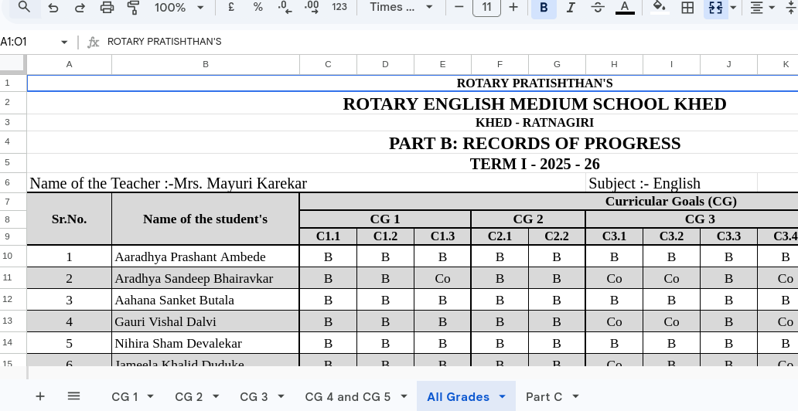

# Grades assignment

* Google sheet Data Format
    * sheet/Tab "All Grades"

- column 1 contains Sr.No. which is Roll number in our system
- column 2 contains Name of the student's which is Name of the learner in our system
- column 3 and onwards contains the subpoints of CG like C1.1 then in next column C1.2 and so on (Row wise this is 9th row)

- from Row 10 and onwards the data is present
    - first sr.No. (ROll Number) then Name of the student's (Name of the learner) and then grade of C1.1 then C1.2 and so on

# filling these grades in pdf:
* first fetch data for each student from google sheet as per above information and guidance.
* then match the Sr.No. of sheet with the Roll Number of the student of that particular class in our system.
* then fill the grades of the student in the pdf in column term 1 and term 2 as per the link associated with term 1 or term 2 in the pdf.
* in pdf from page 5 to page 10 subject is mentioned first so consider that subject to get the correct link of both terms
* there is table in pdf containing columns Curriculum Goals (CG),competencies(C1.1,C1.2,etc), term 1 and term 2
* now match this data correctly with sheet and fill the grades of respective student of respective class.